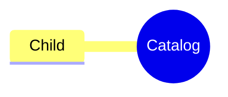

## 0001 — Mermaid Diagram Rendering Pipeline

**Date**: 2026-08-30
**Status**: Accepted

### Context

The documentation site builds with Zensical. Zensical executes Markdown extensions
(such as `pymdownx.superfences`) through its Python bridge, but it does not run
MkDocs plugin event hooks — only `mkdocstrings` is wired up natively. The
`mermaid2` plugin therefore cannot inject the `mermaid.js` runtime: a
` ```mermaid ` fence without a custom formatter renders as a plain code block,
and even with `mermaid2.fence_mermaid` emitting a `<div class="mermaid">`, no
JavaScript reaches the page.

### Decision

Mermaid diagrams render through three parts:

1. **Fence**: `pymdownx.superfences` custom fence `name = "mermaid"` with
   `format = "mermaid2.fence_mermaid"` converts the fence body into
   `<div class="mermaid">`. The `mkdocs-mermaid2-plugin` dependency is used only
   for this formatter function.
2. **Runtime**: `mermaid.min.js` (CDN, pinned version) is loaded via
   `[[project.extra_javascript]]` in `zensical.toml`.
3. **Init**: `docs/assets/javascripts/mermaid-init.js` calls
   `mermaid.initialize({ startOnLoad: false })` with `theme: "base"` and
   light/dark `themeVariables`, then renders via `mermaid.run()`. It is driven
   by Material's `document$` observable rather than `DOMContentLoaded`, because
   `navigation.instant` swaps page content in via XHR without re-evaluating
   `extra_javascript` scripts — see _Instant navigation_ below. The theme
   follows Material's `data-md-color-scheme` attribute at render time.

Authoring a diagram requires a standard ` ```mermaid ` code fence, with the
**diagram type on the first line of the body** rather than in the info string:

````markdown

````

A multi-word info string such as ` ```mermaid mindmap ` is **not** recognised as
a fence at all: the block renders as a literal paragraph of Markdown source and
swallows every following line up to the next ` ``` `, silently eating the rest of
the page. This is why the type belongs on the body's first line — every fence
must have a single-word language.

### Consequences

#### Positive

- Diagrams render on GitHub and on the site from the same Markdown source.
- Light/dark palette support without a plugin hook.

#### Negative / Trade-offs

- Do **not** register the `mermaid2` plugin under `[project.plugins]` — its
  `on_post_page` hook never fires under Zensical, and a second init path would
  double-render diagrams.
- Theme switches require a page reload; diagrams do not re-render on palette
  toggle.
- The CDN pin in `zensical.toml` must be bumped manually to upgrade Mermaid.

### Instant navigation

`navigation.instant` intercepts internal links and swaps the page body in via
XHR. Scripts loaded through `[[project.extra_javascript]]` are evaluated **once**,
at initial page load — they are not re-run for the swapped-in page. Any script
that transforms page content must therefore react to navigation, or it will only
ever work on hard loads: every diagram stays raw Mermaid source and every
`.arithmatex` span stays raw `\(...\)` when a reader arrives by clicking a link.

Material exposes `document$`, an observable that emits on every page change
including the first, so both init scripts subscribe to it and do their work per
emission:

```javascript
if (typeof document$ !== "undefined" && typeof document$.subscribe === "function") {
  document$.subscribe(render);
} else {
  render();
}
```

Two details matter in `render()`:

- The CDN runtimes load asynchronously, so `window.mermaid` / `MathJax.typesetPromise`
  may not exist yet on the first emission — poll until they do.
- A rendered diagram keeps its `.mermaid` class and its children are replaced by
  an `<svg>`; passing it back to `mermaid.run()` would parse that SVG as diagram
  source. Only nodes without an `<svg>` are passed. MathJax consumes the spans it
  processes, so its re-run naturally finds nothing on an unchanged page.
