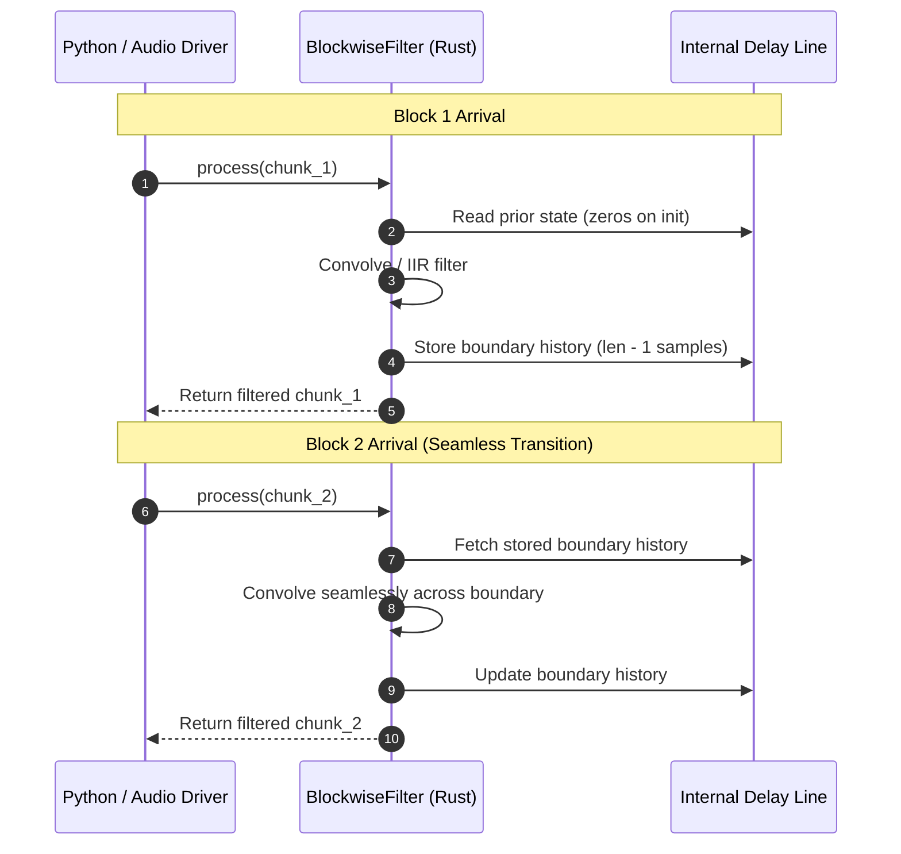

# Blockwise & Streaming Filtering

For long audio files, low-latency streaming pipelines, or memory-constrained environments,
`BlockwiseFilter` processes signals in contiguous chunks while maintaining the filter's delay line and phase states across boundaries.

## Architecture & Delay Line Continuity

When audio is processed block by block, simple convolution truncates boundary tails,
causing audible clicks or frequency distortion at frame transitions. `BlockwiseFilter` preserves internal state buffers
in the native Rust engine between `process()` invocations.



## Python API: `BlockwiseFilter`

### Basic Streaming Example

```python
import numpy as np
from g191_filter import BlockwiseFilter

# Initialize streaming filter with 4096-sample block size
block_size = 4096
bw = BlockwiseFilter(filter_id="mod_irs16khz", block_size=block_size)

# Simulated streaming generator
def audio_stream():
    for _ in range(10):
        yield np.random.randn(block_size)

output_chunks = []
for chunk in audio_stream():
    # Process each chunk with state maintained automatically
    out_chunk = bw.process(chunk)
    output_chunks.append(out_chunk)

filtered_stream = np.concatenate(output_chunks)
```

---

## State Snapshotting & Checkpointing

`BlockwiseFilter` exposes its complete state as a contiguous `float64` NumPy array
through the `.state` property for serialization, pause/resume, and distributed chunk processing.

```python
from g191_filter import BlockwiseFilter
import numpy as np

bw1 = BlockwiseFilter("irs8khz", block_size=2048)

# Process first block
out_1 = bw1.process(np.random.randn(2048))

# Save state checkpoint
saved_state = bw1.state

# Create a new instance (or restore in another worker)
bw2 = BlockwiseFilter("irs8khz", block_size=2048)
bw2.state = saved_state

# Process next block with full continuity
out_2 = bw2.process(np.random.randn(2048))
```

### State Vector Layout

The length of the `.state` array depends on the internal filter topology:

| Topology | Internal State Components | Length Formula |
| -------- | ------------------------- | -------------- |
| **FIR** | Delay line history + decimation phase index `k0` | `filter_len - 1 + 1` |
| **IIR Parallel** | Parallel biquad stage delay lines | `n_stages * 2 + 1` |
| **IIR Cascade** | Cascade biquad stage delay lines | `n_stages * 2 + 1` |
| **IIR Direct** | Direct form delay line history | `max(deg_a, deg_b) + 1` |

---

## Convenience Methods

- **`bw.process_all(input_array)`**: Feeds a complete signal through the chunking loop, returning the concatenated result.
- **`bw.reset()`**: Clears the delay lines and phase counters back to zero initial conditions.

---

## Performance & Latency Comparison

| Processing Mode | Peak Memory Usage | Latency | Recommended Scenario |
| --------------- | ----------------- | ------- | -------------------- |
| **One-Shot** (`filter_array`) | $O(N)$ buffer | Duration of file | Batch datasets, short clips (< 10 min) |
| **Blockwise** (`BlockwiseFilter`) | $O(B)$ buffer | Frame duration ($B / f_s$) | Real-time streams, large WAV files (> 100 MB) |

---

## Example Filter Response

<p align="center">
  
</p>
