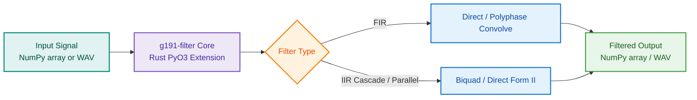

# One-Shot & Batch Filtering

One-shot filtering processes an entire audio signal or buffer in a single function call.
It is the ideal approach when the full signal fits comfortably in memory (e.g., offline dataset preprocessing or file conversions).

## Processing Flow & Architecture



## Python API: `filter_array`

`filter_array` applies any G.191 filter directly to a 1D `numpy.ndarray` (`float64`):

```python
import numpy as np
from g191_filter import filter_array

# Generate or load a 16 kHz audio buffer
sampling_rate = 16000
duration_sec = 2.0
t = np.linspace(0, duration_sec, int(sampling_rate * duration_sec), endpoint=False)
signal = np.sin(2 * np.pi * 1000 * t) + 0.5 * np.sin(2 * np.pi * 5000 * t)

# Apply the Modified IRS wideband filter
filtered_signal = filter_array("mod_irs16khz", signal)

print(f"Input shape: {signal.shape}, Output shape: {filtered_signal.shape}")
```

### Parameter Reference

| Parameter | Type | Default | Description |
| --------- | ---- | ------- | ----------- |
| `filter_id` | `str` | *required* | Filter identifier (e.g. `'irs8khz'`, `'lp7_48khz'`). |
| `input_array` | `np.ndarray` | *required* | 1D NumPy array containing input audio samples. |
| `block_size` | `int` or `None` | `None` | `None` for one-shot convolution; integer for internal chunking. |

---

## Python API: `filter_wave`

`filter_wave` handles reading WAV audio files, decoding formats (16/24-bit PCM, 32-bit float),
executing the filter in Rust, and writing the result to disk:

```python
from g191_filter import filter_wave

# Filter a WAV file and write to a new destination
output_path = filter_wave(
    filter_id="lp35_48khz",
    input_file="input_speech_48k.wav",
    output_file="output_lp35.wav",
)

# In-place overwriting:
filter_wave(
    filter_id="dir_dc_removal",
    input_file="recording.wav",
    inplace=True,
)
```

### Parameter Reference

| Parameter | Type | Default | Description |
| --------- | ---- | ------- | ----------- |
| `filter_id` | `str` | *required* | Filter identifier. |
| `input_file` | `str` | *required* | Path to input WAV audio file. |
| `output_file` | `str` or `None` | `None` | Output path. If omitted and `inplace=False`, appends `_filtered.wav`. |
| `sample_rate` | `float` or `None` | `None` | Target sample rate. If different from input, applies internal resampling. |
| `inplace` | `bool` | `False` | When `True`, safely overwrites `input_file`. |
| `block_size` | `int` or `None` | `None` | Internal block size for streaming file I/O. |

---

## Command-Line Usage

The command-line interface allows filtering files via `uvx` or `uv run`:

```bash
# Basic file filtering
uvx --from git+https://github.com/jr2804/g191-filter.git g191-filter filter \
  --filter-id irs8khz \
  --input-file samples/speech.wav \
  --output-file samples/speech_irs.wav
```

---

## Frequency Response Visualization

The frequency responses for one-shot filtering can be inspected using `get_frequency_response`:

```python
import xy
from g191_filter import get_frequency_response

freqs, mag_db = get_frequency_response("flat_band_pass", n_points=1024, sample_rate=8000)

chart = xy.line_chart(
    xy.line(freqs[freqs >= 50], mag_db[freqs >= 50], name="Flat Band-Pass", color="#0d9488"),
    xy.x_axis(label="Frequency (Hz)", type_="log", domain=(50, 4000)),
    xy.y_axis(label="Magnitude (dB)", domain=(-60, 5)),
    title="Flat Band-Pass (0.3 - 3.4 kHz)",
)
```

<p align="center">
  
</p>
