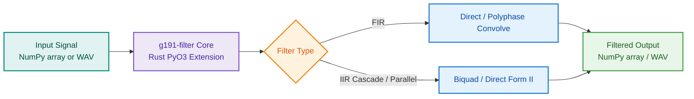

## One-Shot & Batch Filtering

One-shot filtering processes an entire audio signal or buffer in a single function call.
It is the ideal approach when the full signal fits comfortably in memory (e.g., offline dataset preprocessing or file conversions).

### Processing Flow & Architecture



### Python API: `filter_array`

`filter_array` applies any G.191 filter directly to a 1D `numpy.ndarray` (`float64`):

```python
import numpy as np
from g191_filter import filter_array

# Generate or load a 16 kHz audio buffer
sampling_rate = 16000
duration_sec = 2.0
t = np.linspace(0, duration_sec, int(sampling_rate * duration_sec), endpoint=False)
signal = np.sin(2 * np.pi * 1000 * t) + 0.5 * np.sin(2 * np.pi * 5000 * t)

# Apply the Modified IRS wideband filter
filtered_signal = filter_array("mod_irs16khz", signal)

print(f"Input shape: {signal.shape}, Output shape: {filtered_signal.shape}")
```

#### Parameter Reference

| Parameter | Type | Default | Description |
| --------- | ---- | ------- | ----------- |
| `filter_id` | `str` | *required* | Filter identifier (e.g. `'irs8khz'`, `'lp7_48khz'`). |
| `input_array` | `np.ndarray` | *required* | 1D NumPy array containing input audio samples. |
| `block_size` | `int` or `None` | `None` | `None` for one-shot convolution; integer for internal chunking. |
| `sample_rate` | `float` or `None` | `None` | Operational rate of the input data (see below). |

#### Working at Non-Native Sample Rates

G.191 filters are *designed* at a specific rate (exposed by
`get_filter_info(filter_id)["sample_rate"]`, e.g. 16 kHz for `rx_irs16khz`).
The `sample_rate` parameter tells the library the operational rate of your
data:

- **`sample_rate=None` (default):** STL verbatim semantics — the data is
  assumed to sit at the design rate and the coefficients are applied as-is.
  Feeding 48 kHz data to a 16 kHz filter this way scales every designed
  frequency by 3 (the `rx_irs16khz` low-pass corner moves from 3617 Hz to
  10851 Hz). This matches the behavior of the STL command-line tool and is
  useful for conformance testing — but it is a silent footgun in application
  code.
- **`sample_rate=fs`, 1:1 filters:** if `fs` matches the design rate the
  filter runs directly; otherwise the signal is resampled to the design
  rate, filtered, and resampled back to `fs`. The native response is
  preserved at any operational rate, content above the design Nyquist is
  removed (the physically correct device model), and the output length
  equals the input length.
- **`sample_rate=fs`, rate-conversion filters (`*_to_1` / `1_to_*`):**
  accepted at any rate without resampling — these filters perform their
  integrated rate change themselves (output rate = `fs * ratio`), so there
  is nothing to adapt.

```python
# NB/WB device simulation on a 48 kHz pipeline:
data_48k = np.random.default_rng(0).standard_normal(48000)

nb = filter_array("rx_irs16khz", data_48k, sample_rate=48000.0)  # corner stays at 3617 Hz
wb = filter_array("p341_16khz", data_48k, sample_rate=48000.0)   # corner stays at 6998 Hz
```

There is no 48 kHz variant of the P.341 send characteristic in G.191 (only
the IRS family has one, `mod_irs48khz`); the canonical way to apply the WB
send mask in a 48 kHz pipeline is therefore
`filter_array("p341_16khz", x, sample_rate=48000.0)` — not `lp7_48khz`,
which is a plain bandwidth-limiting low-pass without the P.341 mask shape.

---

### Python API: `filter_wave`

`filter_wave` handles reading WAV audio files, decoding formats (16/24-bit PCM, 32-bit float),
executing the filter in Rust, and writing the result to disk:

```python
from g191_filter import filter_wave

# Filter a WAV file and write to a new destination
output_path = filter_wave(
    filter_id="lp35_48khz",
    input_file="input_speech_48k.wav",
    output_file="output_lp35.wav",
)

# In-place overwriting:
filter_wave(
    filter_id="dir_dc_removal",
    input_file="recording.wav",
    inplace=True,
)
```

#### Parameter Reference

| Parameter | Type | Default | Description |
| --------- | ---- | ------- | ----------- |
| `filter_id` | `str` | *required* | Filter identifier. |
| `input_file` | `str` | *required* | Path to input WAV audio file. |
| `output_file` | `str` or `None` | `None` | Output path. If omitted and `inplace=False`, appends `_filtered.wav`. |
| `sample_rate` | `float` or `None` | `None` | Operational rate override (default: input file header rate). See below. |
| `inplace` | `bool` | `False` | When `True`, safely overwrites `input_file`. |
| `block_size` | `int` or `None` | `None` | Internal block size for streaming file I/O. |

Like `filter_array`, `filter_wave` is rate-aware: the operational rate is
taken from the WAV header (or the `sample_rate` override). 1:1 filters
adapt their characteristic to it — a 16 kHz IRS response applied to a
48 kHz file yields the correct response at 48 kHz — while rate-conversion
filters apply their integrated ratio and the output file is written at the
resulting rate (e.g. `hq_down_2_to_1` on a 16 kHz file writes an 8 kHz
file).

---

### Command-Line Usage

The command-line interface allows filtering files via `uvx` or `uv run`:

```bash
# Basic file filtering (filter_id and input_file are positional)
uvx --from git+https://github.com/jr2804/g191-filter.git g191-filter filter \
  irs8khz samples/speech.wav --output-file samples/speech_irs.wav
```

---

### Frequency Response Visualization

The frequency responses for one-shot filtering can be inspected using `get_frequency_response`:

```python
import xy
from g191_filter import get_frequency_response

freqs, mag_db = get_frequency_response("flat1", n_points=1024, sample_rate=16000)

chart = xy.line_chart(
    xy.line(freqs[freqs >= 50], mag_db[freqs >= 50], name="Flat 16 kHz", color="#0d9488"),
    xy.x_axis(label="Frequency (Hz)", type_="log", domain=(50, 8000)),
    xy.y_axis(label="Magnitude (dB)", domain=(-60, 5)),
    title="Flat Band-Pass (16 kHz, 0.1 - 3.4 kHz)",
)
```

<p align="center">
  
</p>

---

### Frequency Response Analysis & CLI Scan

Two complimentary frequency response tools are provided:

1. **Analytical DTFT (`get_frequency_response`)**: Evaluates the transfer function
   directly via the discrete-time Fourier transform over $N$ linear points from
   $0$ to $f_s / 2$. Fastest for plotting and continuous inspection.
2. **Sine-Power Scan (`frequency_response_scan` / `g191-filter freqresp`)**: Port of
   the STL `fltresp` reference tool. For each candidate frequency, synthesizes a
   continuous sinewave, processes it through the filter engine (handling internal
   up-/down-sampling naturally), skips transient edge frames, and measures output
   power relative to input power:

```python
from g191_filter import frequency_response_scan

# Scan flat1 from 50 Hz to 4000 Hz in 250 Hz steps at 16 kHz:
freqs_hz, gains_db = frequency_response_scan(
    "flat1",
    f0=50.0 / 16000.0,    # normalized starting frequency (0..0.5)
    ff=4000.0 / 16000.0,  # normalized end frequency
    fstep=250.0 / 16000.0,
    sample_rate=16000.0,
)
```

Or from the command line:

```bash
# Direct frequency response scan output as a TSV table:
g191-filter freqresp flat1 --fs 16000 --f0 50 --ff 4000 --fstep 250
```
