## ITU-T G.191 Filter Catalog & Specifications

This reference provides technical specifications, transfer function characteristics,
and frequency response figures for all 39 standard ITU-T G.191 filters implemented in `g191-filter`.

### Filter Families at a Glance

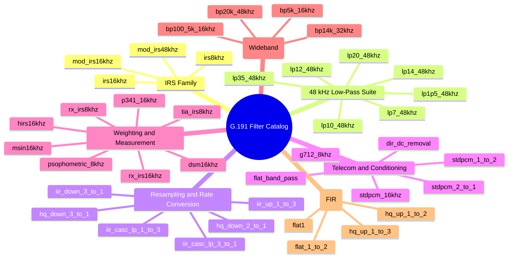
```mermaid
mindmap
  root((G.191 Filter Catalog))
    IRS Family
      irs8khz
      irs16khz
      mod_irs16khz
      mod_irs48khz
    48 kHz Low-Pass Suite
      lp1p5_48khz
      lp35_48khz
      lp7_48khz
      lp10_48khz
      lp12_48khz
      lp14_48khz
      lp20_48khz
    Resampling and Rate Conversion
      hq_down_2_to_1
      hq_down_3_to_1
      iir_down_3_to_1
      iir_up_1_to_3
      iir_casc_lp_3_to_1
      iir_casc_lp_1_to_3
    Telecom and Conditioning
      flat_band_pass
      g712_8khz
      dir_dc_removal
      stdpcm_16khz
      stdpcm_2_to_1
      stdpcm_1_to_2
    Weighting and Measurement
      msin16khz
      psophometric_8khz
      dsm16khz
      hirs16khz
      tia_irs8khz
      rx_irs8khz
      rx_irs16khz
      p341_16khz
    Band-Pass (Wideband)
      bp5k_16khz
      bp100_5k_16khz
      bp14k_32khz
      bp20k_48khz
    Upsampling (FIR)
      hq_up_1_to_2
      hq_up_1_to_3
      flat_1_to_2
      flat1
```

---

### 1. Intermediate Reference System (IRS) Family

The Intermediate Reference System (IRS) models acoustic-to-electrical and electrical-to-acoustic
response curves of telephone handsets. They are indispensable for speech quality testing (e.g. ITU-T P.800, P.862 PESQ, P.863 POLQA).

#### Overview & Family Response

  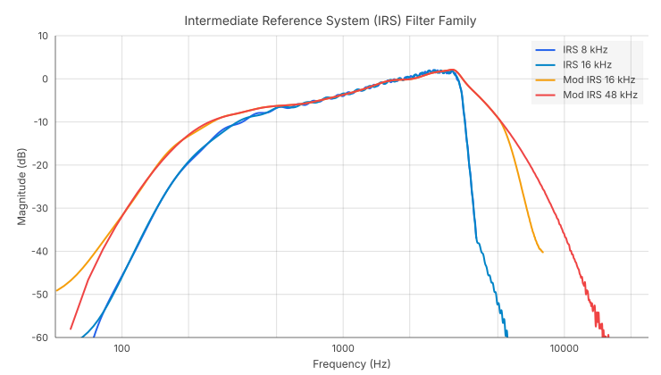

#### Filter Specifications

| Filter ID | Type | Taps | Native Rate | Passband / Roll-off | Application |
| --------- | ---- | ---- | ----------- | ------------------- | ----------- |
| `irs8khz` | FIR | 151 | 8 kHz | 300–3400 Hz shaped | Narrowband telephony sending & receiving response simulation |
| `irs16khz` | FIR | 209 | 16 kHz | 300–3400 Hz shaped | Narrowband IRS evaluated at 16 kHz sampling |
| `mod_irs16khz` | FIR | 495 | 16 kHz | 50–7000 Hz wideband | Modified IRS wideband speech codec evaluation |
| `mod_irs48khz` | FIR | 513 | 48 kHz | 50–7000 Hz fullband | Modified IRS at studio / 48 kHz sampling rate |

#### Individual Frequency Responses

=== "irs8khz (8 kHz)"
    

      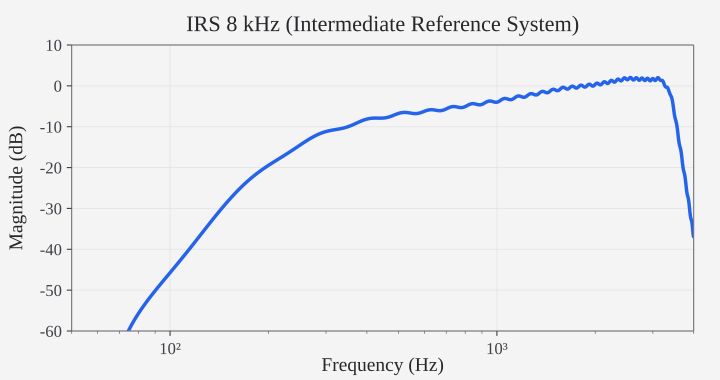
    

=== "irs16khz (16 kHz)"
    

      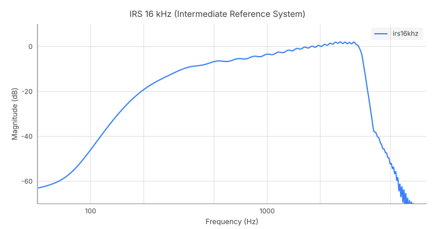
    

=== "mod_irs16khz (16 kHz)"
    

      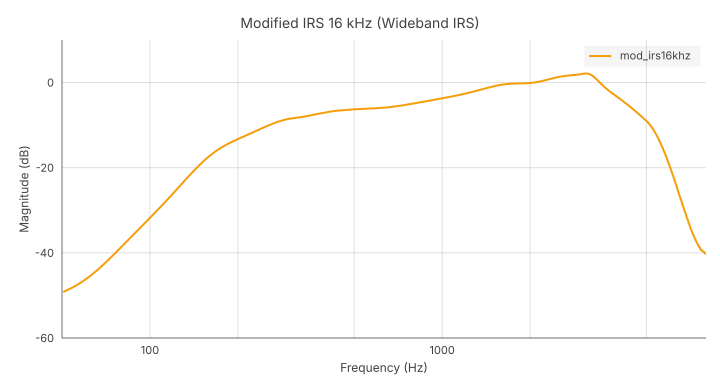
    

=== "mod_irs48khz (48 kHz)"
    

      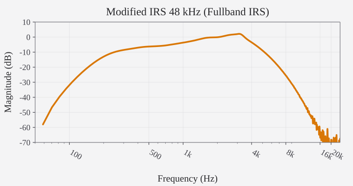
    

---

### 2. 48 kHz Low-Pass Filter Suite

A family of linear-phase FIR low-pass filters for bandwidth limiting at a standard 48 kHz sampling rate.

!!! warning "These are shaping filters, not resampling filters"
    The LP suite rolls off **gradually** from well below its nominal cutoff
    (the nominal value corresponds to ≈ −10 dB, the −3 dB point lies at
    ≈ 0.65 × fc) and its stopband rejection is far from uniform.
    It is **not** a hard/brickwall low-pass and is not suitable as an
    anti-alias / anti-imaging filter for sample-rate conversion — use the
    [Resampling & Rate-Conversion filters](#3-resampling-rate-conversion-filters)
    (−150 … −178 dB, steep transition) for that purpose.

!!! note "Passband gain is not 0 dB"
    The G.191 LP suite is implemented as-designed from the STL reference: the
    filter coefficients sum to ≈ 1.5–1.9 (DC gain ≈ +3.5 … +5.5 dB). This is
    **not** an implementation bug — it is the published STL filter response.
    The family chart below is **normalized to 0 dB DC** so the passband
    ripple and transition shape are easy to compare across cutoffs. The
    individual filter plots show the *true* (unnormalized) response.

#### Family Response

  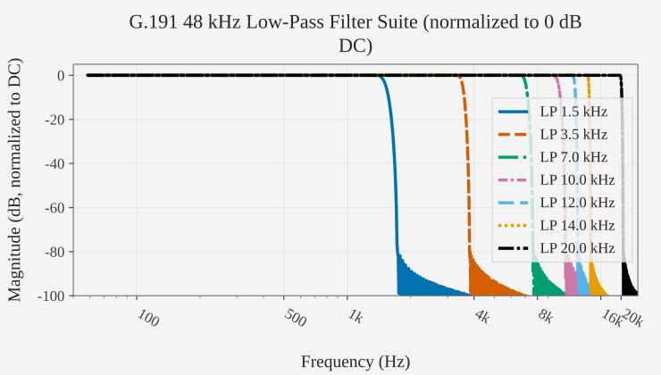

#### Specifications

| Filter ID | Cutoff ($f_c$) | Taps | Intended Band Edge¹ | Attenuation @ Edge² | Rejection @ Nyquist³ | Min. Stopband⁴ |
| --------- | -------------- | ---- | ------------------- | ------------------- | -------------------- | --------------- |
| `lp1p5_48khz` | 1.5 kHz | 333 | 2.0 kHz | −15.8 dB | −126 dB | −126 dB @ 23.4 kHz |
| `lp35_48khz` | 3.5 kHz | 233 | 4.0 kHz | −13.2 dB | −121 dB | −124 dB @ 18.9 kHz |
| `lp7_48khz` | 7.0 kHz | 119 | 8.0 kHz | −12.5 dB | −66 dB | −126 dB @ 18.6 kHz |
| `lp10_48khz` | 10.0 kHz | 87 | 12.0 kHz | −13.0 dB | −55 dB | −116 dB @ 16.7 kHz |
| `lp12_48khz` | 12.0 kHz | 165 | 14.0 kHz | −12.8 dB | −94 dB | −94 dB @ 20.3 kHz |
| `lp14_48khz` | 14.0 kHz | 235 | 16.0 kHz | −19.1 dB | −28 dB | −28 dB @ 22.7 kHz |
| `lp20_48khz` | 20.0 kHz | 165 | 24.0 kHz | −8.8 dB | −9 dB | −12 dB @ 15.4 kHz |

¹ **Intended band edge** — the application-defined limit the filter is meant
 to constrain to (ITU-T NB/WB/SWB/FB and 3GPP EVS designations, detailed
 below the table). The edge lies above the nominal $f_c$ because the
 filter rolls off gradually (see warning above).

² **Attenuation @ Edge** — measured response (DC-normalized) at the intended
 band edge, i.e. how much the filter rejects exactly at the boundary it is
 meant to limit to. About −13 dB for the mid-range LP filters (consistent
 with the published STL response); −19 dB for `lp14` and −9 dB for `lp20`.
 Note `lp20`'s edge *is* the Nyquist frequency, so its attenuation there
 is simply its residual response — effectively no stopband at all.

³ **Rejection @ Nyquist** — magnitude in the top 5 % band below Nyquist
(22.8–24 kHz), the value that matters for aliasing near the folding
frequency. lp14 / lp20 have no real stopband here.

⁴ **Min. Stopband** — minimum of the stopband (f > 1.1·fc),
i.e. a single spectral null; the rejection elsewhere in the stopband
can be markedly weaker (see column 5 and the family chart).

All values **measured** from the implemented coefficient sets (2048-point
frequency response, DC-normalized) — not datasheet targets. The nominal
$f_c$ marks the ≈ −10 dB point of the published STL response, and the
passband shows a monotone droop (e.g. −3.5 dB at 500 Hz for `lp1p5_48khz`),
so neither an equiripple "< 0.05 dB" passband nor a uniform "> 80 dB"
stopband applies.

**Intended band edge reference:** `lp35` (4 kHz) follows the ITU-T
narrowband (NB) limit; `lp7` (8 kHz) the wideband (WB) limit;
`lp12` (14 kHz) the super-wideband (SWB) limit; `lp14` (16 kHz) the
alternative 16 kHz SWB extension used in 3GPP SA4 / EVS codecs;
`lp20` (24 kHz) sits at the Nyquist of 48 kHz, corresponding to the
ITU-T fullband (FB) limit (20 kHz).

#### Individual Responses

=== "lp1p5_48khz (1.5 kHz)"
    

      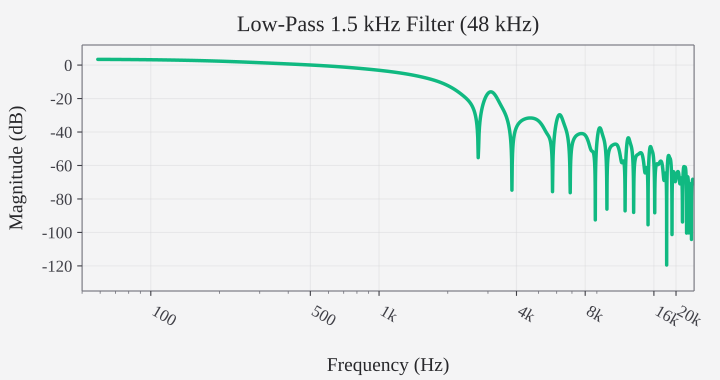
    

=== "lp35_48khz (3.5 kHz)"
    

      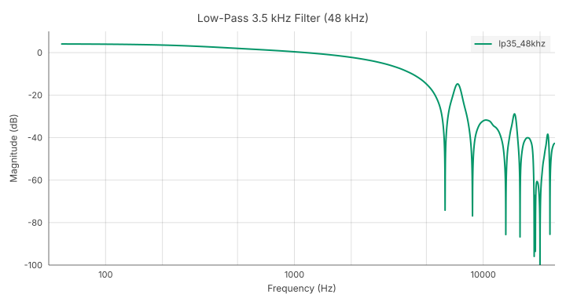
    

=== "lp7_48khz (7.0 kHz)"
    

      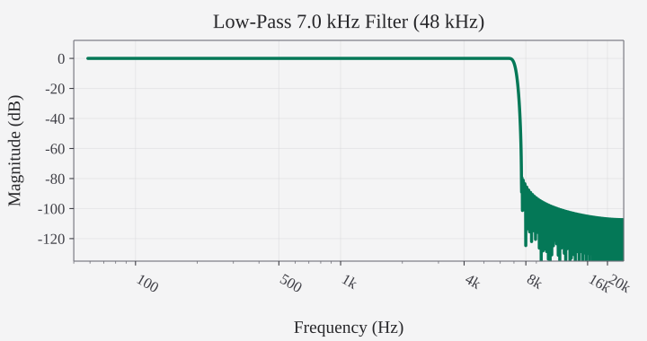
    

=== "lp10_48khz (10.0 kHz)"
    

      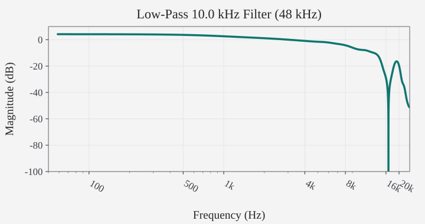
    

=== "lp12_48khz (12.0 kHz)"
    

      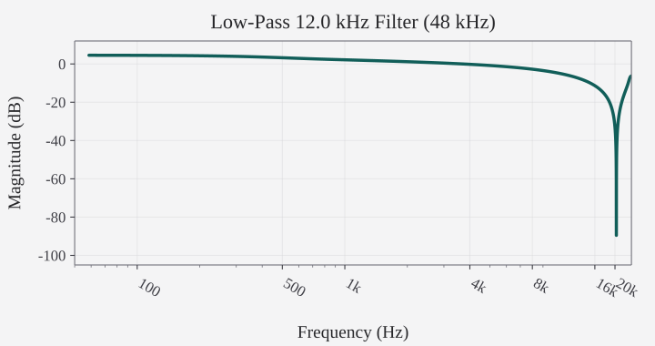
    

=== "lp14_48khz (14.0 kHz)"
    

      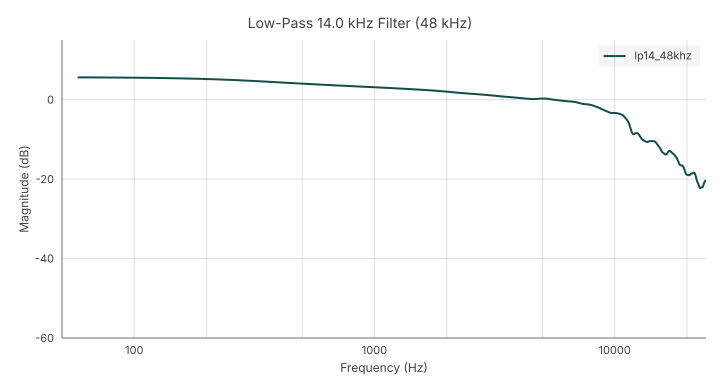
    

=== "lp20_48khz (20.0 kHz)"
    

      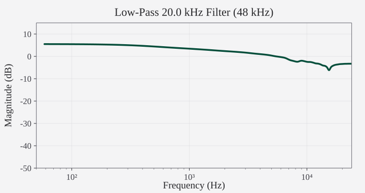
    

---

### 3. Resampling & Rate-Conversion Filters

Filters optimized for integer rate conversion (decimation and interpolation) between standard telecom rates (8, 16, 48 kHz).

#### Family Response

  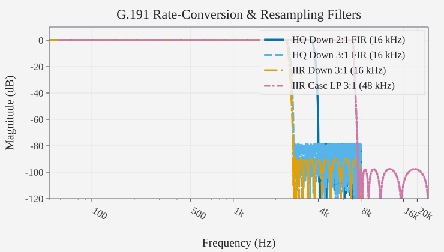

#### Specifications

| Filter ID | Type | Rate Factor | Stages / Taps | Description |
| --------- | ---- | ----------- | ------------- | ----------- |
| `hq_down_2_to_1` | FIR | 2:1 Down | 118 taps | High-quality 2:1 decimation filter (e.g. 16 kHz $\rightarrow$ 8 kHz) |
| `hq_down_3_to_1` | FIR | 3:1 Down | 168 taps | High-quality 3:1 decimation filter (e.g. 48 kHz $\rightarrow$ 16 kHz) |
| `iir_down_3_to_1` | IIR Direct | 3:1 Down | Order 23 | Direct-form 3:1 decimation IIR |
| `iir_up_1_to_3` | IIR Direct | 1:3 Up | Order 23 | Direct-form 1:3 interpolation IIR |
| `iir_casc_lp_3_to_1` | IIR Cascade | 3:1 Down | 7 Biquads | 7-stage biquad cascade low-pass for 3:1 decimation |
| `iir_casc_lp_1_to_3` | IIR Cascade | 1:3 Up | 7 Biquads | 7-stage biquad cascade low-pass for 1:3 interpolation |

#### Individual Responses

=== "hq_down_2_to_1"
    

      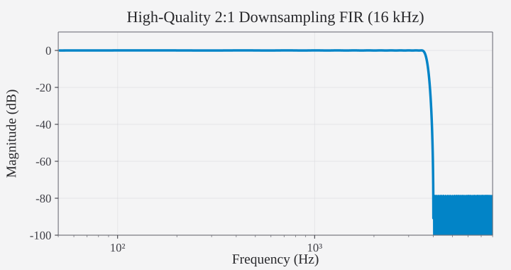
    

=== "hq_down_3_to_1"
    

      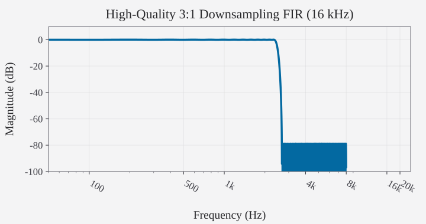
    

=== "iir_down_3_to_1"
    

      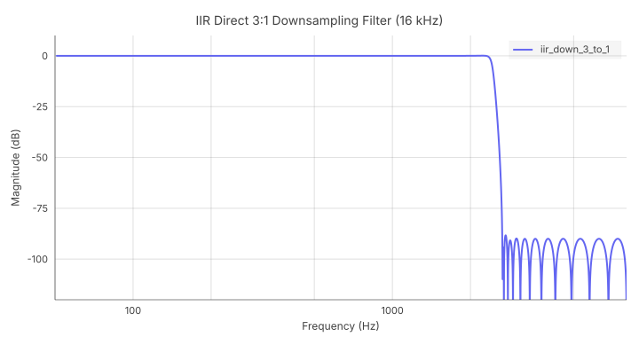
    

=== "iir_up_1_to_3"
    

      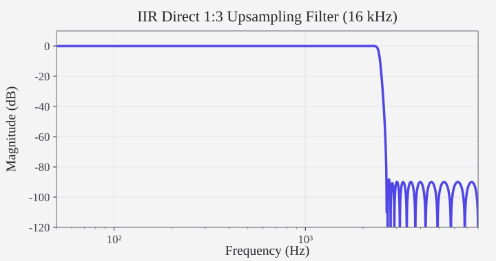
    

=== "iir_casc_lp_3_to_1"
    

      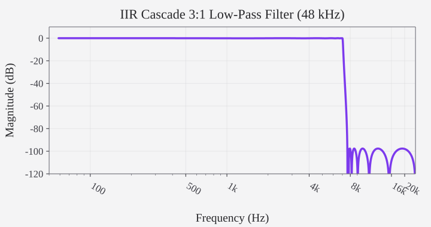
    

=== "iir_casc_lp_1_to_3"
    

      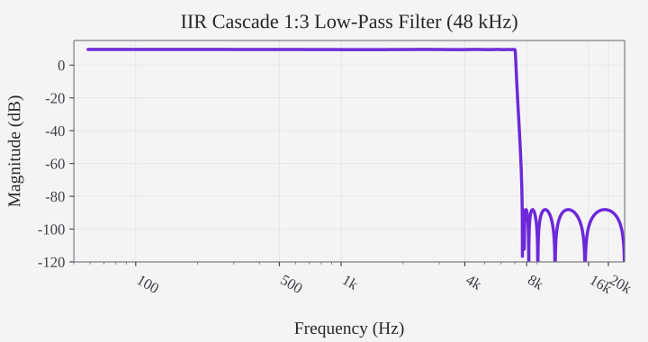
    

---

### 4. Telecom & Conditioning Filters

Filters for voiceband conditioning, standard PCM channel emulation, and DC offset removal.

#### Family Response

  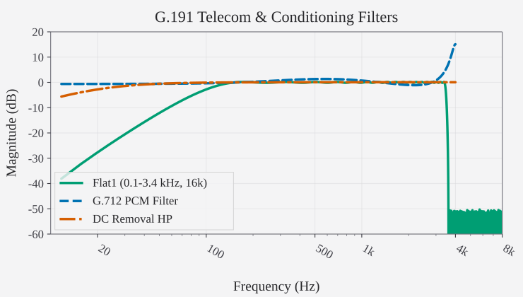

#### Specifications

| Filter ID | Type | Taps / Order | Native Rate | Description |
| --------- | ---- | ------------ | ----------- | ----------- |
| `flat_band_pass` | FIR | 168 taps | 8 kHz | Brickwall 300–3400 Hz bandpass with flat in-band response |
| `g712_8khz` | IIR Parallel | 4 Biquads (Order 8) | 8 kHz | ITU-T G.712 PCM channel filter (attenuation and group delay template) |
| `dir_dc_removal` | IIR Direct | 1st Order ($b=[1, -1], a=[1, -0.985]$) | 8 kHz | High-pass DC offset notch filter |

#### Individual Responses

=== "flat_band_pass"
    

      
    

=== "g712_8khz"
    

      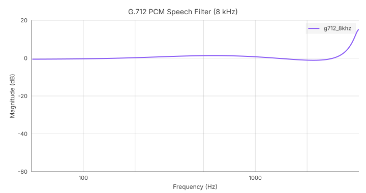
    

=== "dir_dc_removal"
    

      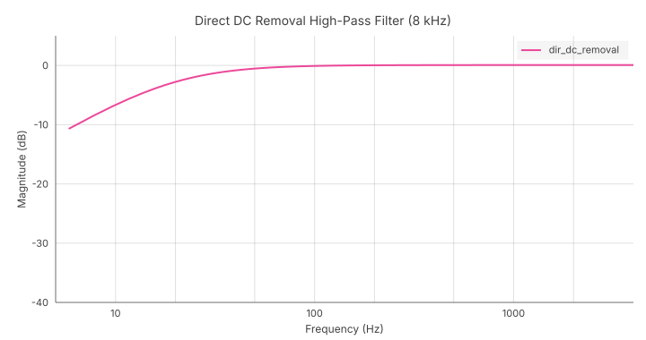
    

---

### 5. Standard PCM IIR Filters

The `stdpcm_*` family provides the ITU-T standard PCM channel reference filter in parallel-form biquad at multiple sample rates and rate-change factors. They share the same coefficients as `g712_8khz` (G.712 PCM weighting, 16 kHz design) but expose 1:1, 2:1, and 1:2 rate variants.

#### Family Response

  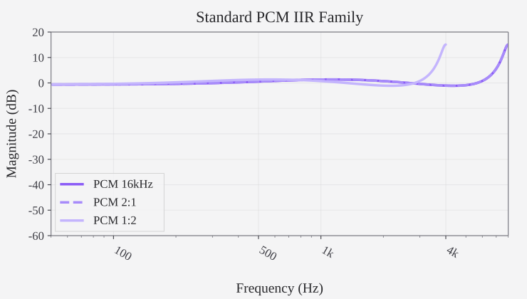

#### Specifications

| Filter ID | Type | Native Rate | Ratio | Description |
| --------- | ---- | ----------- | ----- | ----------- |
| `stdpcm_16khz` | IIR Parallel | 16 kHz | 1:1 | Standard PCM reference filter, 16 kHz |
| `stdpcm_2_to_1` | IIR Parallel | 16 kHz → 8 kHz | 1:2 (down) | Standard PCM downsampling by 2 |
| `stdpcm_1_to_2` | IIR Parallel | 8 kHz → 16 kHz | 2:1 (up) | Standard PCM upsampling by 2 (zero-insertion IIR up-kernel) |

#### Individual Responses

=== "stdpcm_16khz"
    

      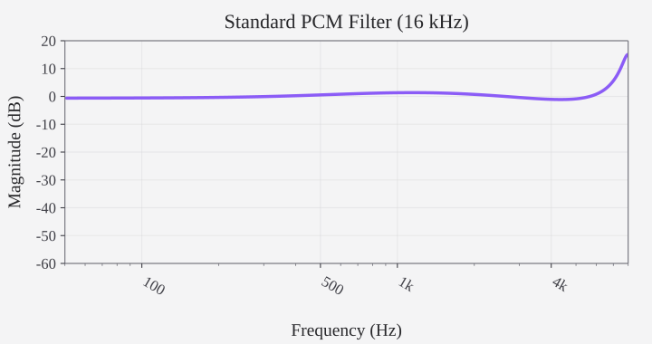
    

=== "stdpcm_2_to_1"
    

      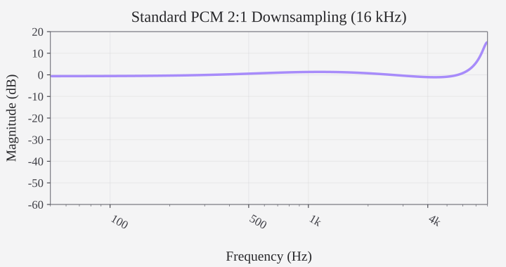
    

=== "stdpcm_1_to_2"
    

      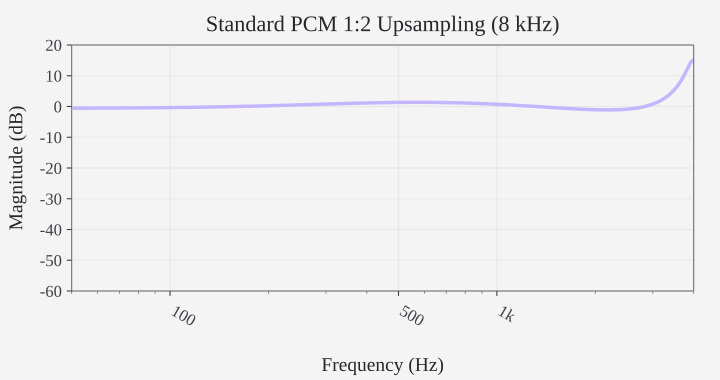
    

---

### 6. Weighting and Measurement FIR Family

These filters implement ITU-T measurement weightings and noise-psophometry weighting for instrumentational and assessment use.

#### Family Response

  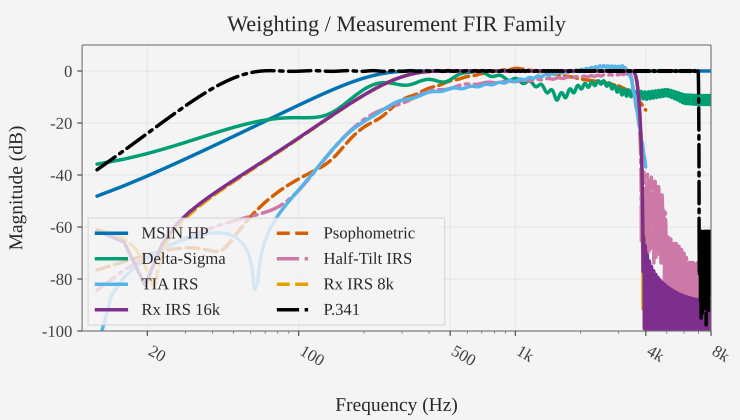

#### Specifications

| Filter ID | Type | Taps | Native Rate | Description |
| --------- | ---- | ---- | ----------- | ----------- |
| `msin16khz` | FIR | 185 | 16 kHz | MSIN (mobile-station-in) high-pass weighting |
| `psophometric_8khz` | FIR | 156 | 8 kHz | Psophometric noise weighting (telephony) |
| `dsm16khz` | FIR | 207 | 16 kHz | Delta-Sigma modulation reconstruction filter |
| `hirs16khz` | FIR | 200 | 16 kHz | Half-Tilt IRS (HT-IRS) send weighting, 16 kHz |
| `tia_irs8khz` | FIR | 151 | 8 kHz | TIA-IRS receive weighting, 8 kHz |
| `rx_irs8khz` | FIR | 75 | 8 kHz | Receive side of modified IRS, 8 kHz |
| `rx_irs16khz` | FIR | 148 | 16 kHz | Receive side of modified IRS, 16 kHz |
| `p341_16khz` | FIR | 592 | 16 kHz | ITU-T P.341 send-part weighting, 16 kHz |

#### Individual Responses

=== "msin16khz"
    

      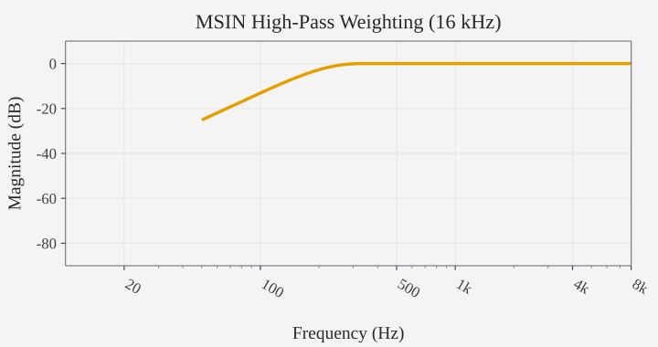
    

=== "psophometric_8khz"
    

      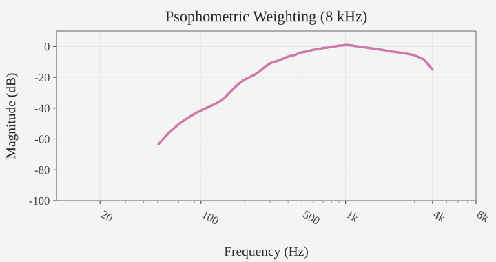
    

=== "dsm16khz"
    

      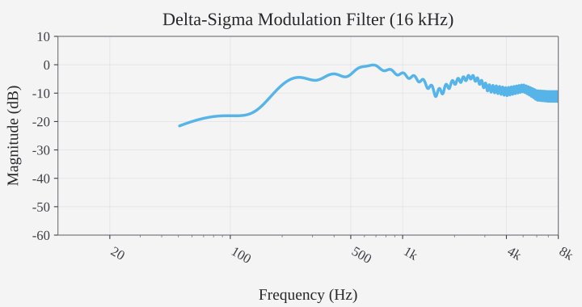
    

=== "hirs16khz"
    

      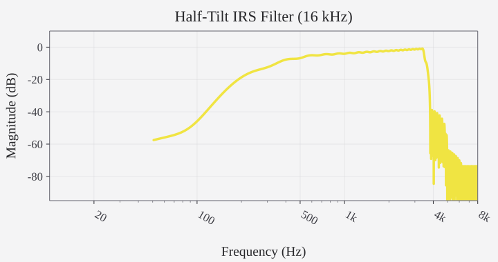
    

=== "tia_irs8khz"
    

      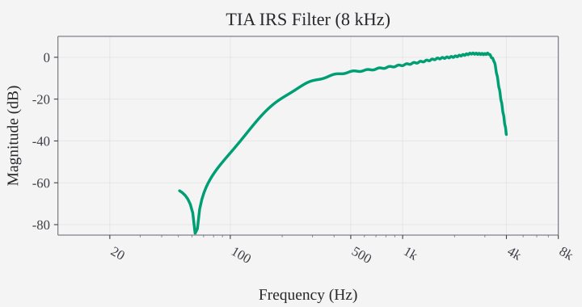
    

=== "rx_irs8khz"
    

      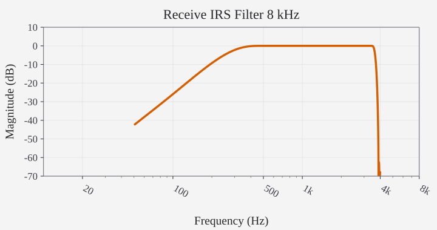
    

=== "rx_irs16khz"
    

      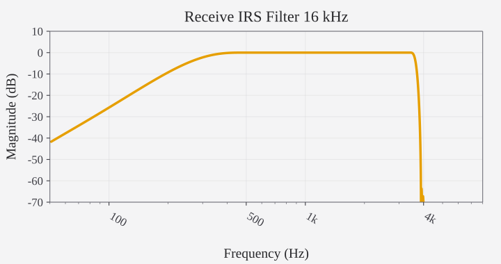
    

=== "p341_16khz"
    

      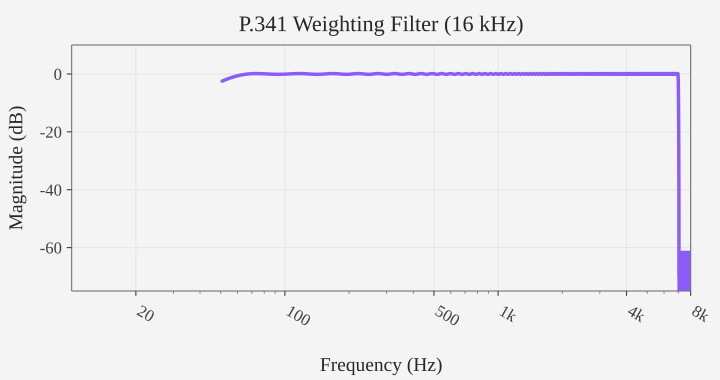
    

---

### 7. Wideband Band-Pass FIR Family

Brickwall-style band-pass filters for splitting signal bands (P.50-type measurement, speech band limiting, wideband speech codec pre-processing).

#### Family Response

  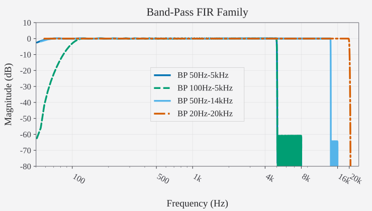

#### Specifications

| Filter ID | Type | Taps | Native Rate | Description |
| --------- | ---- | ---- | ----------- | ----------- |
| `bp5k_16khz` | FIR | 592 | 16 kHz | Band-pass 50 Hz–5 kHz |
| `bp100_5k_16khz` | FIR | 603 | 16 kHz | Band-pass 100 Hz–5 kHz |
| `bp14k_32khz` | FIR | 1119 | 32 kHz | Band-pass 50 Hz–14 kHz |
| `bp20k_48khz` | FIR | 4001 | 48 kHz | Band-pass 20 Hz–20 kHz (fullband) |

#### Individual Responses

=== "bp5k_16khz"
    

      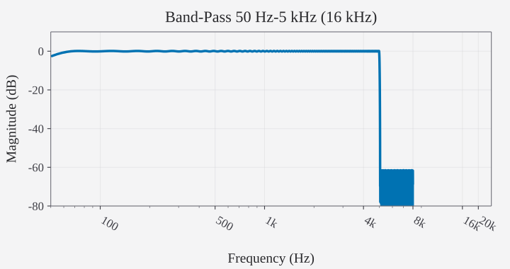
    

=== "bp100_5k_16khz"
    

      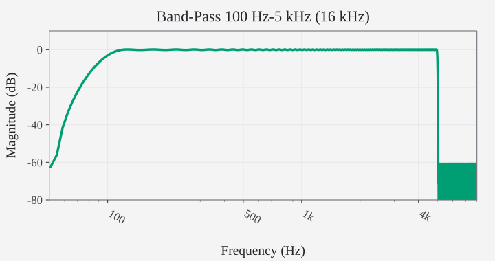
    

=== "bp14k_32khz"
    

      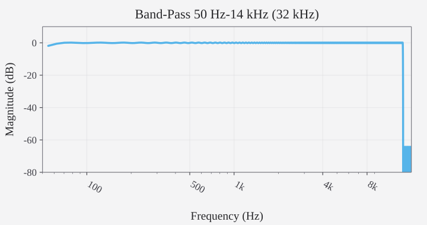
    

=== "bp20k_48khz"
    

      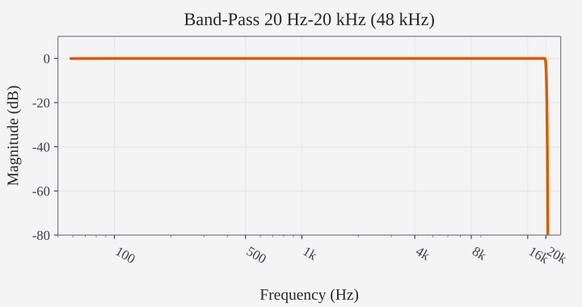
    

---

### 8. Upsampling FIR Family

High-quality interpolation filters for 1:2 and 1:3 upsampling, reusing the HQ down-sampler coefficient set with the `fir_upsampling_kernel` and appropriate gain.

#### Family Response

  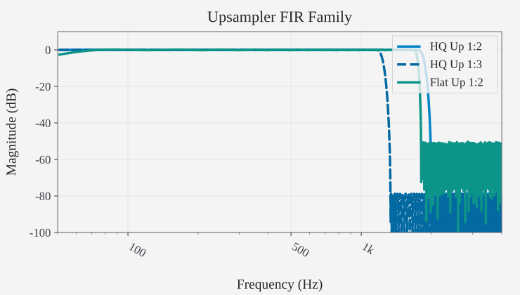

#### Specifications

| Filter ID | Type | Taps | Native Rate | Ratio | Description |
| --------- | ---- | ---- | ----------- | ----- | ----------- |
| `hq_up_1_to_2` | FIR | 118 | 8 kHz | 2:1 (up) | High-quality 1:2 upsampler (reuses `hq_down_2_to_1` coeffs, gain 2.0) |
| `hq_up_1_to_3` | FIR | 168 | 8 kHz | 3:1 (up) | High-quality 1:3 upsampler (reuses `hq_down_3_to_1` coeffs, gain 3.0) |
| `flat_1_to_2` | FIR | 168 | 8 kHz | 2:1 (up) | Flat band-pass 1:2 upsampler |
| `flat1` | FIR | 168 | 8 kHz | 1:1 | Flat band-pass 1:1 (pass-through filter) |

#### Individual Responses

=== "hq_up_1_to_2"
    

      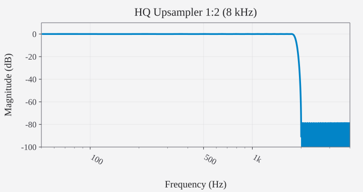
    

=== "hq_up_1_to_3"
    

      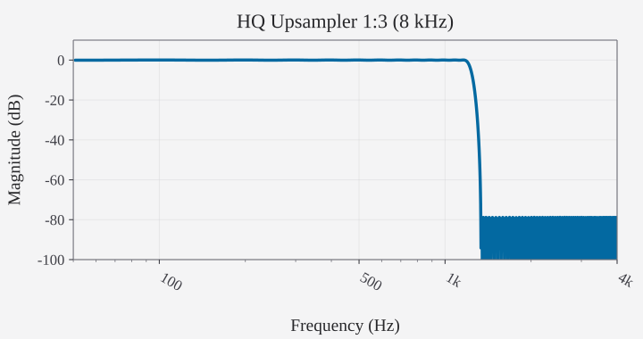
    

=== "flat_1_to_2"
    

      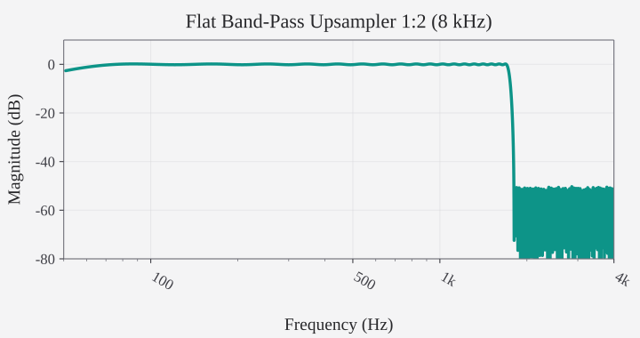
    

=== "flat1"
    

      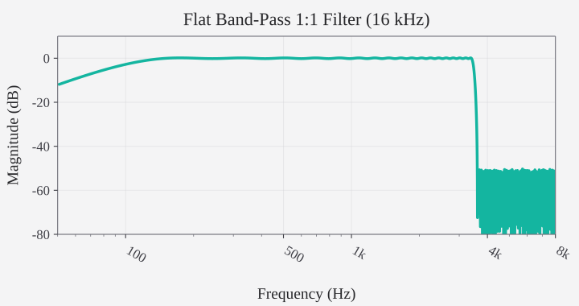
    

